# TypeScript 入門攻略

[toc]

# 壹、TypeScript 安裝與環境建置

online compiler & Demo : https://www.typescriptlang.org/play


## 1-1. Node.js 

安裝路徑 :  https://nodejs.org/en/

* node -v   >> 查看 node.js 安裝版本


## 1-2. TypeScript (TSC)

* npm i -g typescript  >>  安裝 typescript
* tsc - v   >> 查看 tsc 安裝版本

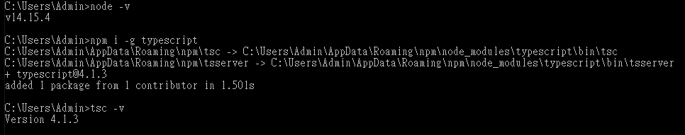


建立 hello.ts 於自定義之目錄  C:/public/mode01

```typescript
var i:number = 100;
console.log(i+100);
```

CMD 切換至 C:/public/mode01 目錄，執行以下語法

* tsc hello.ts   >> 產生hello.js

* node hello.js  >> 執行hello.js 

> 200  >> 結果 

使用 TS 編譯失敗範例

```typescript
var i:number = 100;
i="aaa";
console.log(i+100);
```

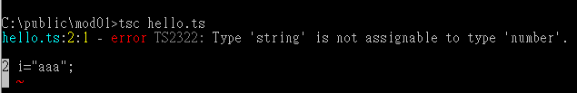

編譯失敗也會產生 js 檔案 。


## 1-3. ts-node

學習用套件，可直接執行.ts檔。

* npm i -g ts-node 

* ts-node hello.js  >> 執行hello.js 

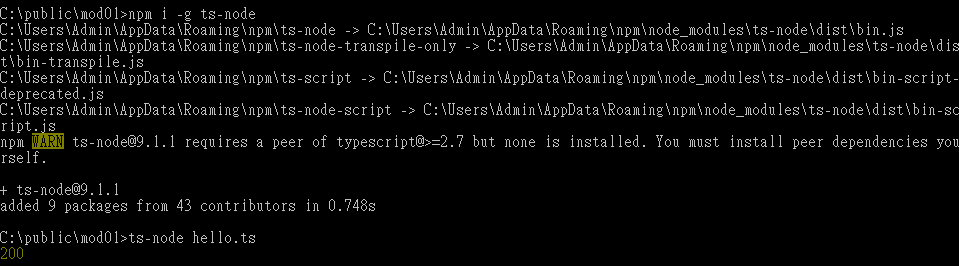

於 VS Code 安裝 Code Runner 後，對 TypeScript 執行程式會直接執行 ts-node 語法動態執行程式碼。


## 1-4. VS Code

安裝路徑 : https://code.visualstudio.com/

File > Open Folder > 選擇自定義目錄 ( or 專案路徑 )

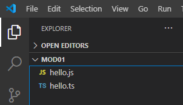

VS Code 安裝 Extension 擴充套件 Code Runner ( 安裝後可直接對 js / ts 直接進行右鍵 )

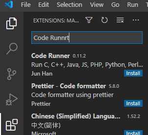

設定 File > Preference > Settings > Extension > Run Code Extension > Clear Previous Output

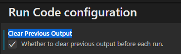

設定 File > AutoSave (自動儲存)  **[註] 於開發Angular專案時建議不要使用此設定**

設定 File > Preference > Settings > Commonly Used Front Size 22


## ＊ 建立專案

tsc --init   >> 會產生 tsconfig.json 

於此json可以定義編譯時的設定 EX. 使用的 Javasciprt版本、編譯後的檔案輸出目錄 ... 

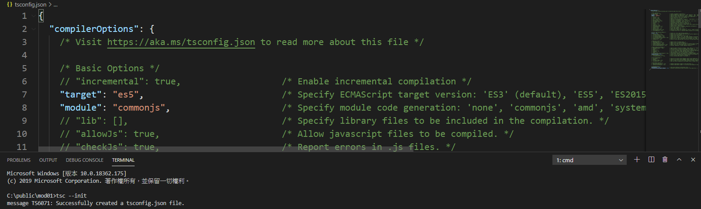

outDir 取消註解 (ctrl + k + u) 改為 "outDir": "./js"

於該目錄執行 tsc 會產生專案檔

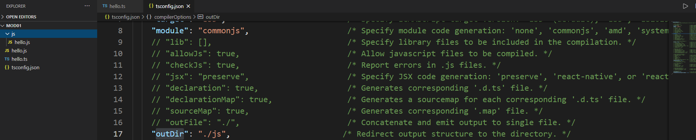

於 View > Command Palette > Configure Default Build Task

* 模式一 、 透過 Teriminal > Run Build Task >  直接對整個目錄編譯。
* 模式二 、 即時編譯 Watch 模式，可以開兩個視窗 ( 一個 ts 一個編譯後的 js )，編譯完後 js 會自動產生變化。

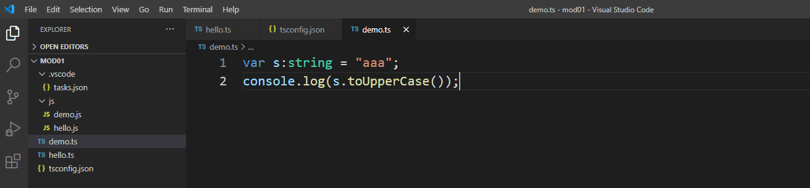

於Extension 安裝 code snippets > Clg ==> console.log


# 貳、基本型別簡介

## 2-1. var 提升 與 let 語法 (ES5 VS ES6)

範本:  03_var.js

var 有提升作用

```typescript
console.log(i);  //hoist, undefined

var i=10;

console.log(i);   //10
```

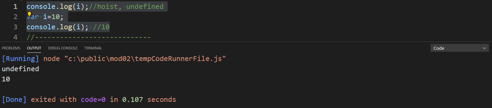

let 沒有提升

```typescript
console.log(i);  //hoist, undefined

let i=10;

console.log(i);   //10
```

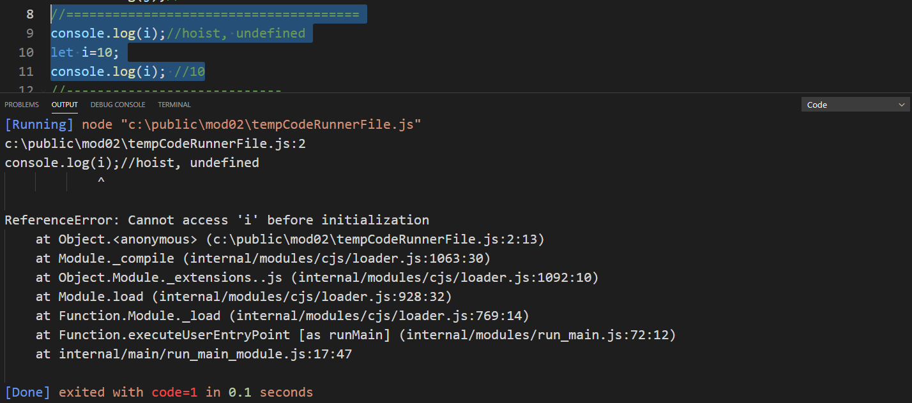

var 可以重複宣告

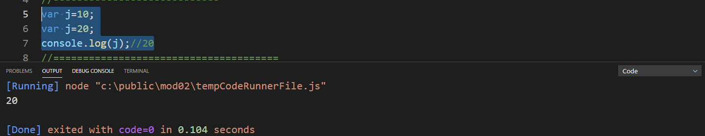

let 不可以

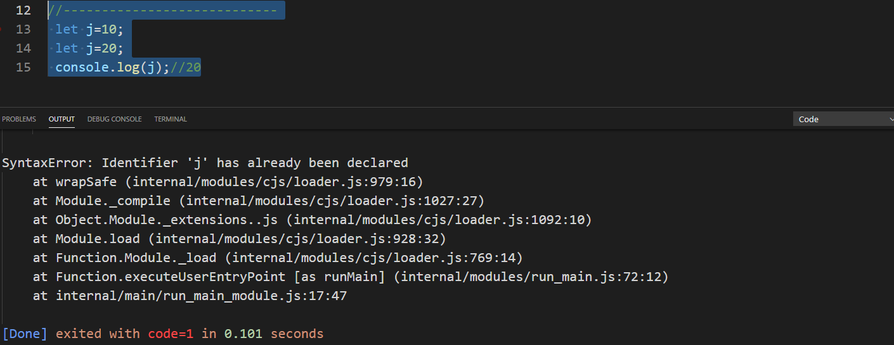

結論: TypeScript 盡量使用 let 語法，避免使用 var 。


## 2-2. 指派與預設(推斷)變數型別

範本:  04_type.ts

1. 直接指定數字

```typescript
let n:number=10;
console.log(n);
```

2. 指定數字，之後指定值。

```typescript
let m:number;
m=20;
console.log(m);
```

3. 推斷資料型別，推斷後該資料型別已定型，不可再改變。

```typescript
let k=30;
// k="aaa"; ==> 若執行編譯 Type Script 不會過。
console.log(k);
```

4. 沒有宣告 let 變數，會變成 any，會和寫 javascript 一樣，型別會動態決定，雖然程式編譯不會錯，

   但會造成動態執行時可能出現無法預期的錯誤，請盡量避免使用。

```typescript
let x; //any
x=10;
x="aaa";
console.log(x);
```


## 2-3. 數字特性 (ES5 VS ES6)

範本:  05_number.ts

更改 tsconfig ES5 => ES6

ES5 => 不支援0b、0o 但會自己轉 js 數字

ES6 => 支援，所以不會轉(使用原本的數值)


## 2-4. String Template (ES5 VS ES6)

範本:  06_string.ts

ES5 不支援樣板寫法 不過TypeScript編譯會自己轉

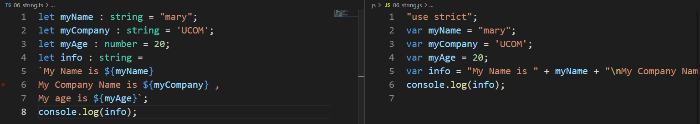

ES6 支援樣板語法，會保留樣板格式

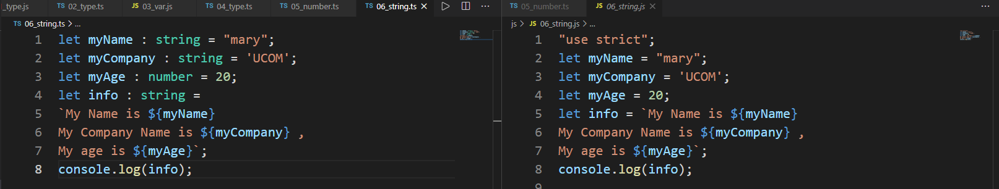


## 2-5. 陣列宣告方式

範本: 07_array.ts

陣列內的元素都要用相同的型別。

A. 一般 Array 寫法

```typescript
let seasons: string[] = ["Spring", "Summer", "Autumn", "Winter"];

console.log(seasons[0]);

seasons[0] = "春天";

console.log(seasons[0]);
```

B. 泛型寫法

```typescript
let seasons: Array<string> = ["Spring", "Summer", "Autumn", "Winter"];

console.log(seasons[0]);

seasons[0] = "春天";

console.log(seasons[0]);
```


## 2-6. Tuple 宣告方式

範本: 08_tuple.ts

* 表示可容納多個不同型別的容器資料型態
* 內容有其上限，和 Array 不同

```typescript
var coordinate: [number, number];

coordinate = [10,20];

console.log(coordinate[0],coordinate[1]);
```

以下為不同資料型態取值方式

```typescript
var data:[number,string ,Date]=[100,"aaa",new Date()];

console.log(data[0]+50, data[1].toUpperCase(), data[2].toLocaleTimeString("zh-tw"));
```


## 2-7. Enum 宣告與使用方式

範本: 09_enum.ts

宣告方式

```typescript
enum Color 
{
	red, blue, green
}

let c: Color = Color.red;
```

調整數值與顯示內容，顯示內容會透過索引值反查取得。

```typescript
enum Color {
	red = -1, blue, green
} // red = -1 , blue = 0 , green = 1 

let c: Color = Color.blue; // 0 

console.log(Color.blue);
console.log(Color[1]);
console.log(Color[c]);
```

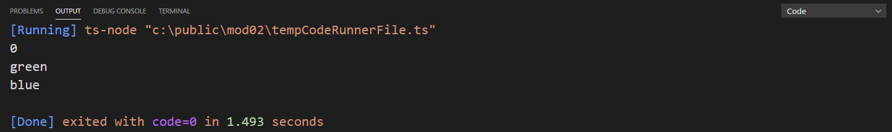


## 2-8.  Null / Undefined 的宣告使用

範本: 07_object.js

Undefined  --> 物件不存在  , null  --> 物件存在但沒有值。

* 不可以指派null給數值

```typescript
// let i:number=10;
// i=null;
```

* 除非使用 union type 方式指定

```typescript
let i:number|null=10; //union type
i=null;
```

* Undefined 不可以直接輸出

```typescript
// let j:number;
// console.log(j); 
```

* 除非使用 union type 方式指定

```typescript
let j:number|undefined; //union type
console.log(j);
```

[註] 變數名稱衝突 (如果不同typescript可使用namespace來預防)


## 2-9.  Any

11_any.ts

盡量避免使用因為，沒有提示，錯誤也不會編譯告知。

以下為 使用 Any 時執行錯誤狀況，編譯會通過，但產出的 js 執行階段也會出現錯誤。

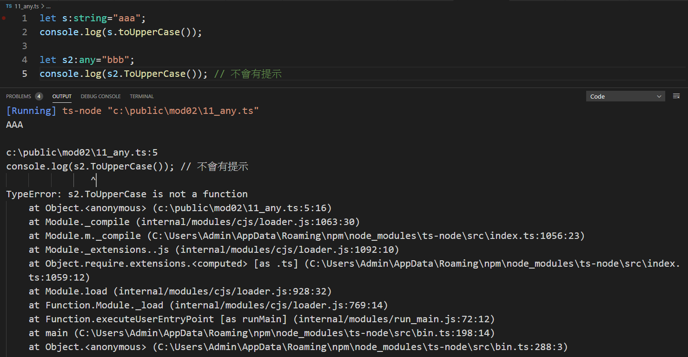


##  2-10.  Void 

範本: 12_void.ts

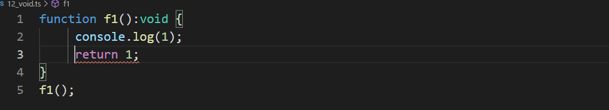

指定 void 回傳值後不可以有回傳值。

如果去接值，會出現undefined。

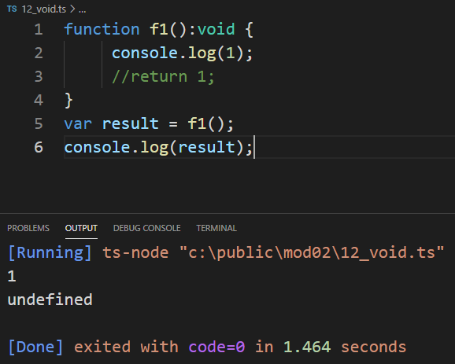


## 2-11. Inferance

範本: 13_Inferance.ts

* any 盡量避免使用，但會有推斷的功能。
* function的參數不可以不指定型別 ，可以使用 ES6 於參數初始化來做推斷


## 2-12.  Assertion

範本: 14_assertion.ts

* 用途為強制轉型
* 原先為 any , 使用 dot operator 會無法解析其成員與方法。
* 強制轉型後 dot operator可解析
* 使用強轉型有兩種方法 「<number>a 」或 「a as number 」。

```typescript
let a:any = 100.345;

//let a:any="aaa";

console.log(typeof(a));  >> 會出現number 

console.log((<number>a).toFixed(2));

console.log((a as number).toFixed(2));
```

改成 let a:any="aaa";使用 tsc 編譯會過，但是執行階段會有錯誤。

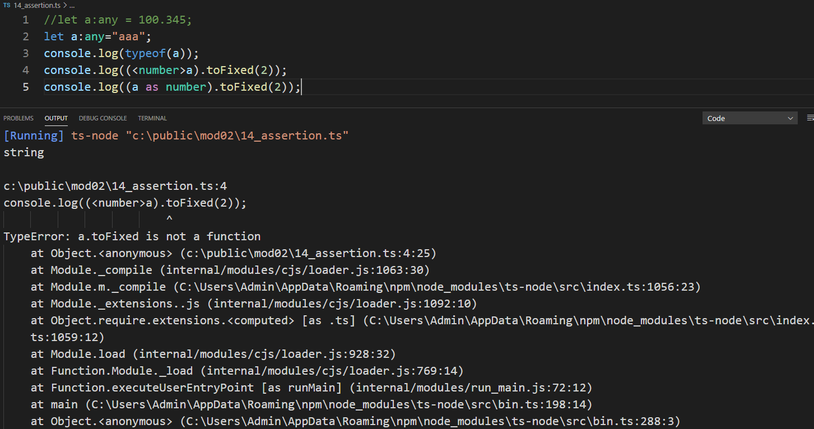


# 參、複雜型別簡介

## ＊ interface

interface 不是類別 , 只有 typescript 才有， javascript 沒有，

是用來限制與產生複雜的資料型別用，不會產生對應的 JS 程式碼。


## 3-1. inline Interface

範本: 01_inline.ts

* 指定物件型別，直接於行內宣告

* 單次使用沒有考慮重複使用。

  **p:{x:number, y:number}  代表參數 p 需要是一個「具有 x 和 y 兩個數值型別」的型別。 **

```typescript
function func1(p:{x:number, y:number}) {
	console.log(p.x, p.y);
}

func1({x:10,y:20})
```

ES6 寫法使用「  => 」

```typescript
let func1= (p:{x:number, y:number})=> {
	console.log(p.x, p.y);
};
```


## 3-2.  Interface

範本: 02_interface.ts

重複使用介面時，先定義再宣告使用，介面是用來限制物件資料型別用的。

以下屬於僅定義資料的 interface

> interface MyFunc {
>
> ​		x:number;
>
> ​		y:number;
>
> }


> function func1(p:MyFunc) {
>
> ​		console.log(p.x, p.y);
>
> }


> let func2=function (p:MyFunc) {
>
> ​		console.log(p.x, p.y);
>
> };


## 3-3.  Interface with Array

範本:  03_interface.ts

book 直接透過 inference 推斷，來做 book型別的指定

book2 透過 inline interface 指定其型別

> let book = {title:"ts",price:200};
>
> console.log(book.title,book.price);
>
> // book.id=1; //error
>
> let book2:{title:string, price:number};
>
> book2={title:"js",price:300};
>
> console.log(book2.title,book2.price);

直接定義 interface Book，並宣告books 是用來存放 Book 的 Array，並且指派上面兩種符合規範的物件。

> interface Book{
>
> ​		title:string;
>
> ​		price:number;
>
> }
>
> 
>
> let books:Book[]=[book,book2];
>
> books.forEach(element => {
>
> ​		console.log(element.title, element.price);
>
> });


## 3-4. interface optional

範本: 04_optional.ts

以下使用 ? 表示 y 可有可無。

> interface MyFunc {
>
> ​		x: number;
>
> ​		y?: number;
>
> }
>
> let func3 = (p: MyFunc) => {...}
>
>  func3({ x: 10,y:100 });
>
> func3({ x: 200 });

範例中，確保 p.y 不存在， 使用 === 嚴格的檢核。

> if (p.y===undefined) {
>
>  ​		console.log(p.x)
>
> } else {
>
>  ​		console.log(p.x, p.y)
>
> }

原因可參考以下資訊 

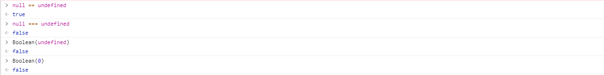

若使用 if (p.y)  當判斷 當 p.y = 0 的時候會判讀成 false ，與原先用意不同。


## 3-5. Function with Interface

範本: 05_function.ts

*  使用 interface 呼叫簽名 ( call Signature)
*  類似 C# Delegate 委派
*  用interface來描述函式

宣告使用方式

>interface 介面名稱
>
>{
>
>​		(方法參數) : 回傳參數
>
>} 

```typescript
interface MathFunction {
	(x:number,y:number):number;
}
```

以下使用的範例，add 和 sub 限制回傳的型別要符合 MathFuction 這個 Interface 

```typescript
let add:MathFunction=function (i,j) {
	return i+j;
};

let sub:MathFunction=(i,j)=>i-j;
console.log(add(100,200));
console.log(sub(500,300));
```


## 3-6. index

範本: 06_indexable.ts

* 索引型別，只有Array的索引功能。

* 資料的使用方式在於型別，以下範例如果沒有 length:number ，for迴圈中的length就不能使用。因為他沒有length屬性。

* Array 本身就有索引屬性和Length屬性，所以可以指派給我們指定的型別。

```typescript
interface DepartmentArray {
	readonly [index: number]: string;
	length:number
}

let ar:DepartmentArray = ['IT', 'Sales', 'Accounting'];

for (let i = 0; i < ar.length; i++) {
	console.log(ar[i]);
}
```


## ＊ 物件


## 3-7. Javacript 物件使用方式

範本: 07_object.js

* Javacript 物件宣告

* 在寫function時若使用this，請不要使用 => ES6 寫法

```typescript
employee.showInfo=function () {
	return this.empName+", "+this.age;
};
```


## 3-8. Type Template

範本: 08_type_template.ts

因為初始化了employee，已經指定他的型別只能接收兩個參數。

所以就不能加方法，如果要新增方法或屬性，一開始就要定義。

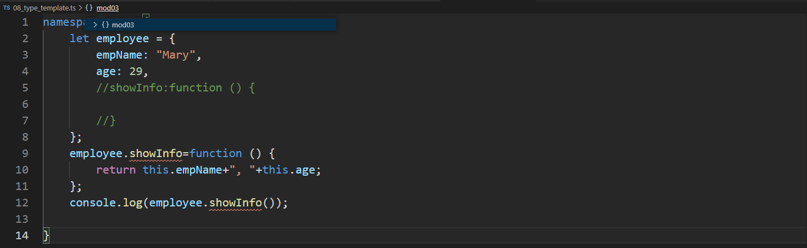


## ＊ 類別

ES6 才有的功能


## 3-9. Class

範本: 09_class.ts

* type 描述 ( 編譯過不會產生 )

* 建構子
* 方法

產出的 ES 5  == >ES5 會需要使用function和prototype組成。

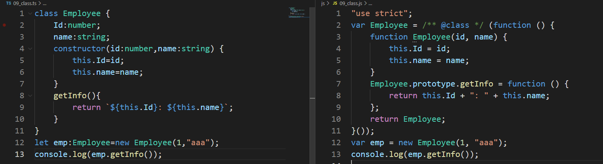

產出的 ES 6 只有建構子跟方法。

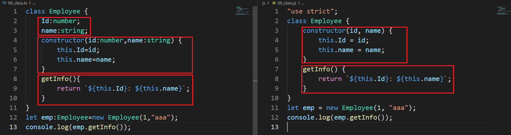

若只有屬性設定，會自己產生預設建構子。

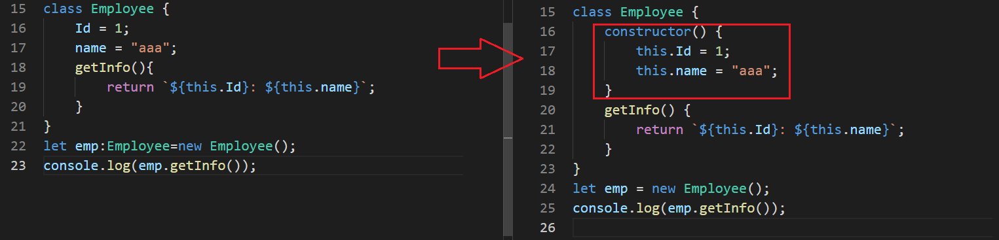


## 3-10. CLASS 存取詞 public / private

範本: 10_public.ts

* private 限制存取範圍，只有class內的方法可以使用。
* 預設都是public 

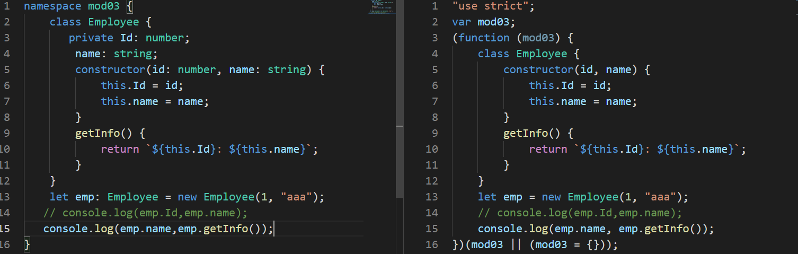


## 3-11. Ctor ( Constructor ) 簡便寫法

範本: 11_ctor.ts

* 於 Constructor 初始化時寫了存取方式後，產生的語法會自行將成員指定。
* 如果沒有宣告存取原則，嘖嘖不會自動建立，需要指定

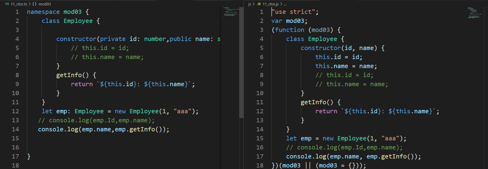


## 3-12. Accessor

範本: 12_accessor.ts

使用一般寫法，並撰寫Accesor

```typescript
class Employee {
	private name!:string;
	constructor(private id: number, name: string) {
		this.Name=name;
	}
	public set Name(v:string){
		this.name=v.toUpperCase();
	}
	public get Name(){
		return this.name+"...";
	}
}

let emp: Employee = new Employee(1, "aaa");
// emp.Name="bbb"
console.log(emp.Name);
```

不適合用簡便寫法，因為會產生不必要的程式碼 this.name = name。

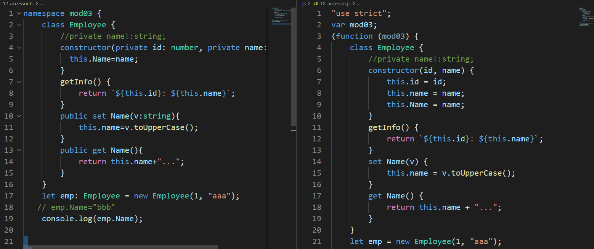

這樣寫，編譯出的就不會有多餘程式碼。

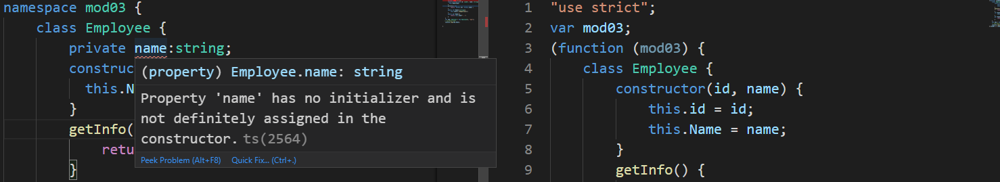

但是因為 name 沒有初始值編譯器會出錯，所有要在 name指定屬性時使用 驚嘆號 來略過編譯器檢查。

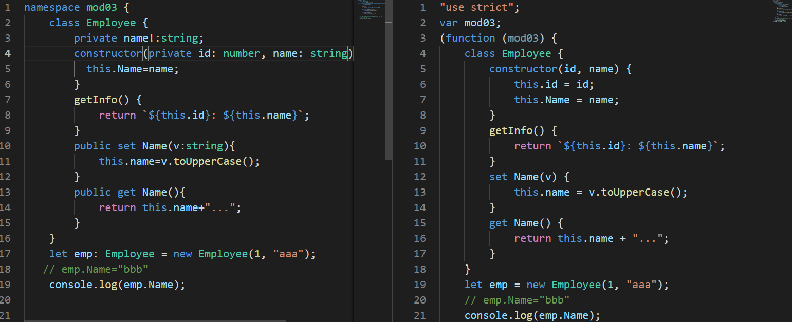

**快速實做 Accessor方法 ** > 

* 方法一、 對參數右鍵 Refactor 選 generate getter setter 即可。


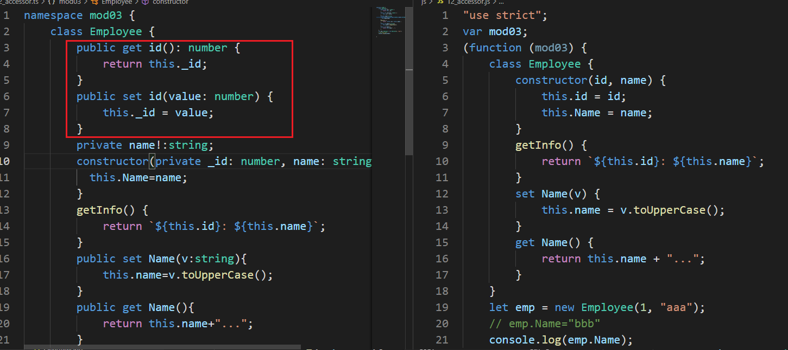

* 方法二、 prop 關鍵字跳出後用 tab

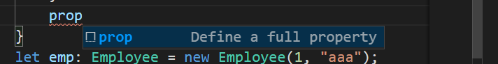

會自動產生以下 Accessor 範本

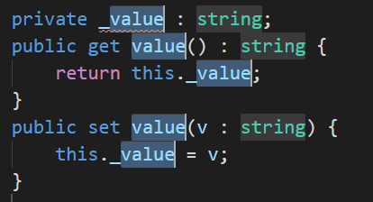

